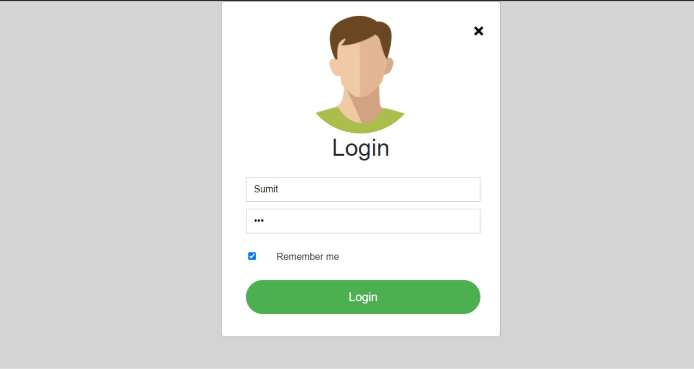
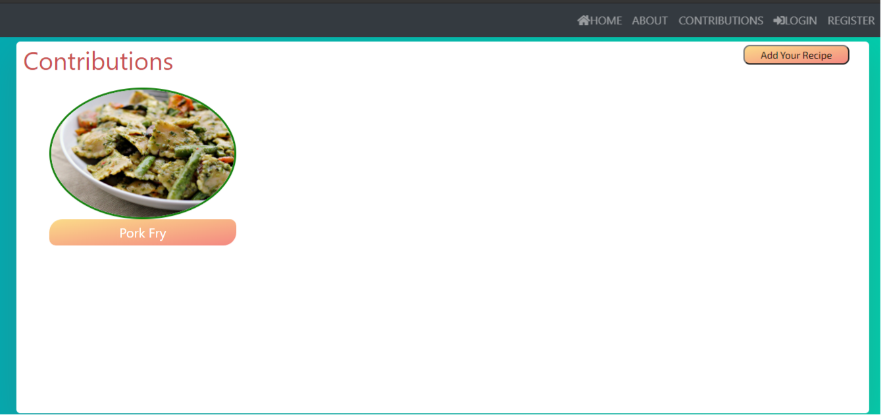

# 
**easyRecipes**

### Home Page

---
### Login Page

---
### Register Page

---
### Contributions Page

---
### Recipe Details Page

---
## Contributions are Welcomed :)

## TLDR
Easy recipes is a Web App which is implemented from scratch.Its all for the Cooks and Chefs out there to explore lists of food recipes and contribute his/her own signature recipes and trying to connect with all the food lovers out there. 

## About the Project
- Search for list of recipes using the easyRecipes web app
- Filter your searched based on no of servings
- Contribute your own explored recipes towards the outside world
- Has over more than 1 lakh recipes
- Search recipes at an instant
- Secured Authentication System

## Tech Stack Used
- Front-End
    - HTML
    - CSS
    - Bootstrap
    - javascript
- Back-End
    - Languge
        - PHP
    - Database
        - MySQL
        - Firebase Local Storage(For storing images)
- Tools
    - Mailgun(For testing email Services)
- Library Used
    - SwiftMailer(For sending Email's)    

## Future Scope
- Creating a section for comparing two same recipes based on User-Experience